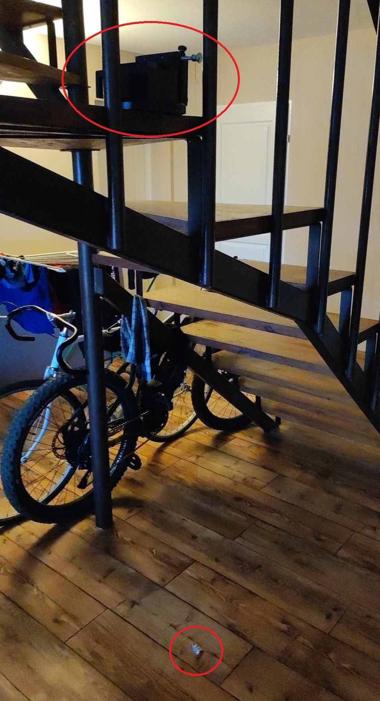

# Mathematical Pendulum Analysis
This project is designed to estimate the gravitational acceleration from a video file containing a recording of an oscillating pendulum. It includes two main files:

1. **extract_video_segment.py**: This file is used to extract a segment from a video file based on specified start and end times.

2. **fluctuation_counter.py**: This file contains functions to detect the period of color fluctuations corresponding to a specified target color in a video.

## Pendulum example



## How to Use
The project is ready to run immediately after downloading, as it contains prepared video material that can be analyzed.
### 1. extract_video_segment.py

This script allows you to extract a segment from a video file. Follow these steps to use it:

- Ensure you have Python installed on your system along with the required library `moviepy`.
- Open the `extract_video_segment.py` file and specify the path to your input video file (`video_path`).
- Specify the start time (`start_time`) and end time (`end_time`) of the segment you want to extract.
- Run the script. It will extract the specified segment from the video and save it as a new video file.

### 2. fluctuation_counter.py

This script is used to analyze a video and estimate the gravity acceleration based on the fluctuations of a pendulum. Follow these steps to use it:

- Ensure you have Python installed on your system along with the required libraries (`cv2` and `numpy`).
- Open the `fluctuation_counter.py` file and specify the path to your video file (`video_path`) and the RGB values of the target color (`target_color`).
- Run the script. It will analyze the video and print the estimated period and gravity acceleration.

## Example Usage

### Example 1: Extracting Video Segment

Suppose you have a video file named `video.mp4`. You want to extract a segment starting from 4 seconds to the end of the video and save it as `vds/measurement.mp4` in the `vds` directory. Here's how to do it:

```python
from moviepy.video.io.ffmpeg_tools import ffmpeg_extract_subclip
from moviepy.editor import VideoFileClip

video_path = "video.mp4"
clip = VideoFileClip(video_path)

start_time = 4
end_time = clip.duration

ffmpeg_extract_subclip(video_path, start_time, end_time, targetname="vds/measurement.mp4")

```
### Example 2: Analyzing Color Fluctuations

Suppose you have a video file named `measurement.mp4` located in the `vds` directory. You want to calculate gravity acceleration based on the fluctuations of a pendulum with a given length (for me it is 1.25) and a target color of your pendulum base RGB (for me it is [104,161,179]). Here's how to do it:

```python
from functions import fluctuation_counter, calculate_gravity_acceleration

pendulum_length = 1.25
video_path = "vds/measurement.mp4"
target_color = [104,161,179] # RGB
period = fluctuation_counter(video_path, target_color[::-1])
print(calculate_gravity_acceleration(period, pendulum_length))
