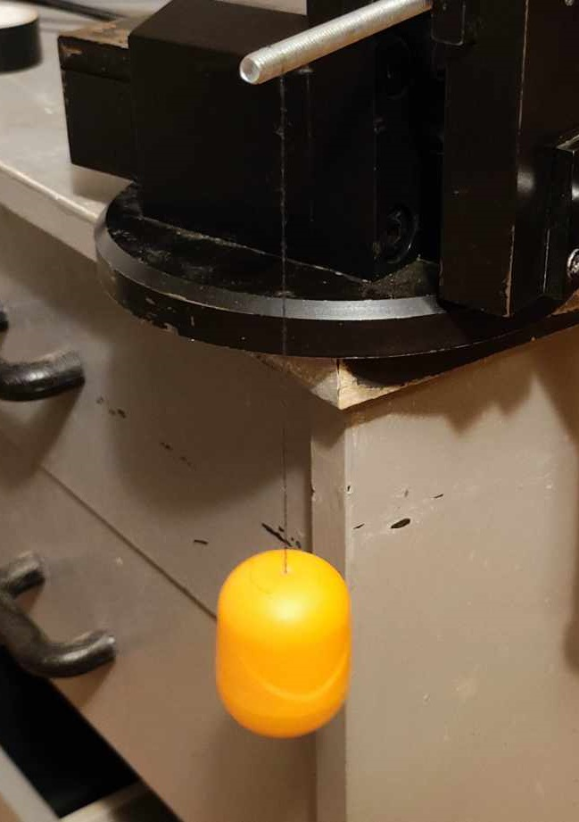
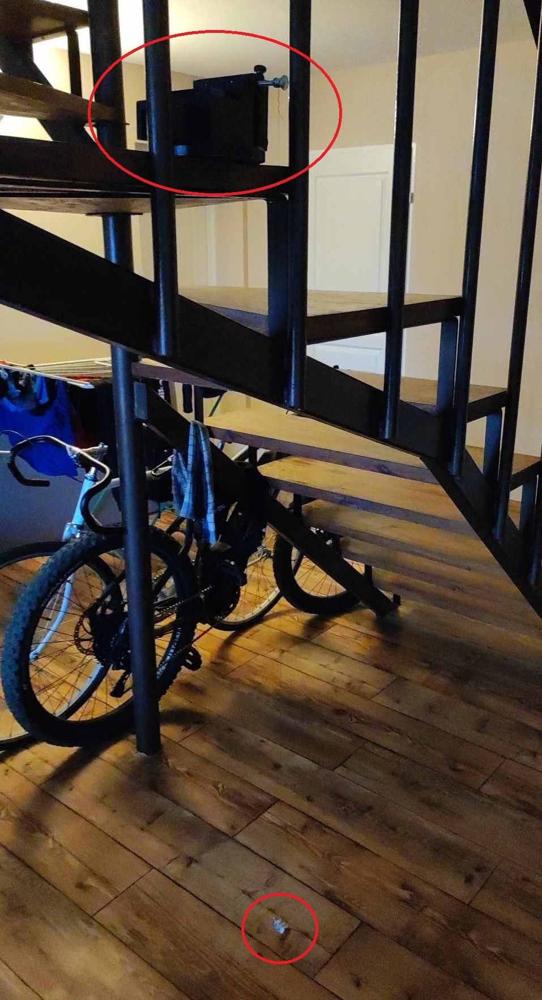
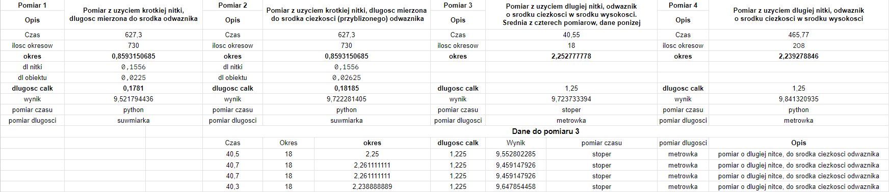

[](https://github.com/perqu/math-pendulum/blob/main/README.md)
[](https://github.com/perqu/math-pendulum/blob/main/README.pl.md)

# Analiza Matematycznego Wahadła
Ten projekt został stworzony w celu oszacowania przyspieszenia ziemskiego na podstawie pliku wideo przedstawiającego oscylujące wahadło.

## Przykład wahadła



## Pomiary dla różnych wahadeł (stoper i skrypt python)

Linki do pliku w google docs oraz w formacie csv.

[](https://github.com/perqu/math-pendulum/blob/main/data/measurements.csv)
[](https://docs.google.com/spreadsheets/d/1XhGYWd3TXwpD9Gf9mUDflV4fyDKOh834PaEkRYOEbg8/edit?usp=sharing)



## Analiza

Przy tworzeniu domowego wahadła należy zwrócić uwagę na takie aspekty jak:
- Długość nici
- Ciężar i rozmiar kulki
- Stabilność konstrukcji
- Precyzja pomiaru
- Odpowiednie warunki otoczenia

### Pomiar długości

W pierwszym projekcie (zdjęcie nr 1) nić była przymocowana do śruby, a wahadlo przebite igłą przez kinder jajko. Nić była krótka, a jajko było problematyczne w wyznaczeniu jego środka ciężkości, gdyż było wypelnione monetami (groszaki). Nić dla usztywnienia z obu stron zostala doklejona klejem cyjano-akrylowym, co sprawdziło się świetnie.

W drugim projekcie (zdjęcie nr 2) nić została zamieniona na wiele dłuższą, co ułatwiło dokładny pomiar. Samo wahadlo zostało wymienione na śrubę z czterema nakretkami, dla nakrętek środek ciężkości znajdował się w centralnym punkcie, więc wystarczyło zmierzyć wysokość nakretki i podzielić ją na pół.

Do pomiarów mniejszych wartości była używana suwmiarka, natomiast do większych odległości metrówka.

### Pomiar Czasu

Pierwsze testowe pomiary zawsze były wykonywane przy pomocy stopera, nastepnie uśrednieniu czterech kolejnych pomiarów, a ostatecznie najdokładniejszy wynik udało się uzyskać dzięki napisanemu przeze mnie programowi, który znajduje się w repozytorium(pendulum_counter.py). Ten skrypt z nagrania wideo oblicza przyspieszenie ziemskie po podaniu długości i koloru wahadła.


## Jak używać

Projekt jest gotowy do uruchomienia natychmiast po pobraniu, ponieważ zawiera przygotowany materiał wideo, który można przeanalizować.

### 1. extract_video_segment.py

Ten plik służy do wyodrębnienia fragmentu z pliku wideo na podstawie określonego przedzialu czasu - początkowego i końcowego. Postępuj zgodnie z poniższymi punktami, aby z niego skorzystac:

- Upewnij się, że masz zainstalowany Python na swoim systemie oraz wymaganą bibliotekę moviepy.
- Otwórz plik extract_video_segment.py i określ ścieżkę do pliku wideo wejściowego (video_path).
- Podaj czas początkowy (start_time) i końcowy (end_time) segmentu, który chcesz wyodrębnić.
- Uruchom skrypt. Wyodrębni on określony segment z wideo i zapisze go jako nowy plik wideo.

### 2. pendulum_counter.py

Ten skrypt służy do analizy wideo i oszacowania przyspieszenia ziemskiego na podstawie nagrania wahadła. Postępuj zgodnie z poniższymi krokami, aby go użyć:

- Upewnij się, że masz zainstalowany Python na swoim systemie oraz wymagane biblioteki (cv2 i numpy).
- Otwórz plik pendulum_counter.py i określ ścieżkę do pliku wideo (video_path), dlugosc wahadla(pendulum_length) oraz wartości RGB koloru docelowego (target_color).
- Uruchom skrypt. Zanalizuje on wideo i wyświetli oszacowany okres oraz przyspieszenie ziemskie.

## Przykład użycia

### Przykład 1: Wyodrębnianie segmentu wideo

Załóżmy, że masz plik wideo o nazwie video.mp4. Chcesz wyodrębnić segment zaczynający się od 4 sekundy do końca wideo i zapisać go jako vds/measurement.mp4 w katalogu vds. Oto jak to zrobić:

```python
from moviepy.video.io.ffmpeg_tools import ffmpeg_extract_subclip
from moviepy.editor import VideoFileClip

video_path = "video.mp4"
clip = VideoFileClip(video_path)

start_time = 4
end_time = clip.duration

ffmpeg_extract_subclip(video_path, start_time, end_time, targetname="vds/measurement.mp4")

```
### Przykład 2: Analiza ruchu wahadla

Załóżmy, że masz plik wideo o nazwie measurement.mp4 znajdujący się w katalogu vds. Chcesz obliczyć przyspieszenie ziemskie na podstawie nagrania ruchu wahadła o określonej długości (w moim prezypadku 1.25) i kolorze podstawy Twojego wahadła w formacie RGB (w moim prezypadku [104,161,179]). Oto jak to zrobić:

```python
from functions import fluctuation_counter, calculate_gravity_acceleration

pendulum_length = 1.25
video_path = "vds/measurement.mp4"
target_color = [104,161,179] # RGB
period = fluctuation_counter(video_path, target_color[::-1])
print(calculate_gravity_acceleration(period, pendulum_length))